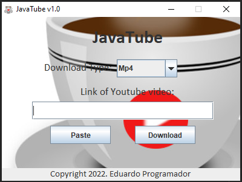
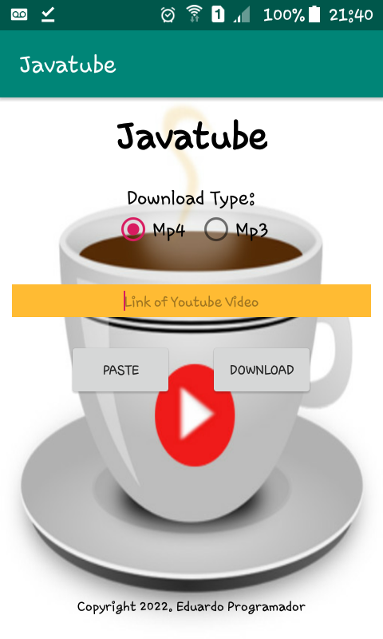

# JavaTube (GUI)

## (Desktop)

## (Android)

## English

A mini Desktop application that download videos and audio from 
Youtube Links. To run the Application, just execute the 
"JavatubeGUI.jar" file in your Windows, Linux, Mac OS or 
Raspberry PI machine. It is so easy, just past the link 
in the program, choose the desired format (mp3 or mp4) and 
click on the Download button.
For Android: See android "directory" to get the apk.

## Portuguese

Uma miniaplicação Desktop que baixa vídeos e áudio de links do 
Youtube. Para executar a aplicação, apenas execute o arquivo 
"JavatubeGUI.jar" no seu dispositivo Windows, Linux, Mac OS ou 
Raspberry PI. É tão fácil, apenas copie o link no programa, 
escolha o formato desejado (mp3 ou mp4) e clique no botão 
Download.
Para Android: Veja o diretório "android" para baixar o apk.

## Copyright 2022. Eduardo Programador

All Rights Reserved.
Todos Os Direitos Reservados.